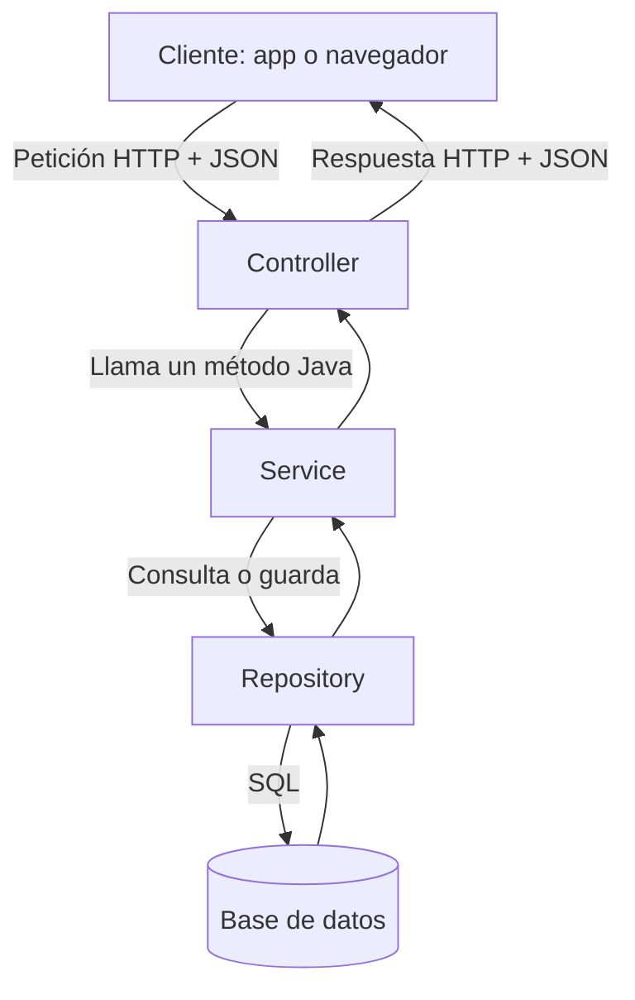
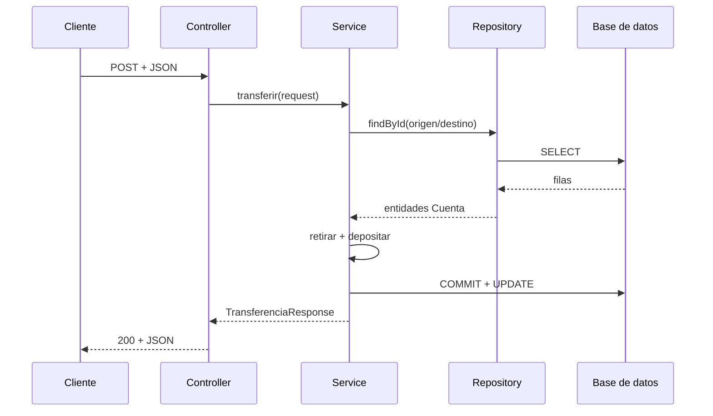

# Guía completa de la Clase 5: REST, Spring Boot, beans, inyección, MVC y base de datos

Esta guía está pensada para vos, Mikko, partiendo de una base concreta: **ya sabés Java y programación orientada a objetos**, pero todavía no conocés Spring Boot. Por eso, cada concepto nuevo se conecta con cosas que ya manejás: clases, objetos, interfaces, constructores, métodos y excepciones.

No intentes memorizar las anotaciones al principio. Primero entendé la historia completa:

> Un cliente envía una petición HTTP. Spring encuentra el método Java que debe atenderla. Un controller recibe los datos, un service aplica las reglas del negocio, un repository accede a la base de datos y Spring devuelve una respuesta HTTP en formato JSON.

Todo el contenido del PDF entra dentro de esa historia.

---

## 1. El mapa mental que conecta toda la clase

Imaginemos una aplicación bancaria. Desde una app móvil, una persona quiere transferir dinero.

La app móvil podría enviar algo parecido a esto:

```http
POST /api/transferencias HTTP/1.1
Content-Type: application/json

{
  "cuentaOrigenId": 1,
  "cuentaDestinoId": 2,
  "monto": 150.00
}
```

Nuestro programa Spring Boot recibe esa petición y la procesa así:



Cada pieza tiene una responsabilidad:

| Pieza         | Responsabilidad            | Lo que no debería hacer             |
| ------------- | -------------------------- | ----------------------------------- |
| Controller    | Entender HTTP y delegar    | Implementar toda la lógica bancaria |
| Service       | Aplicar reglas del negocio | Conocer detalles de HTTP            |
| Repository    | Leer y escribir datos      | Decidir reglas del negocio          |
| Base de datos | Conservar el estado        | Atender peticiones HTTP             |

Ésta es la conexión que faltaba entre las diapositivas. `@RestController`, `@Service` y `@Repository` no son tres decoraciones aisladas: son etiquetas que permiten que Spring encuentre esas clases, cree sus objetos y conecte una capa con la siguiente.

---

## 2. Antes de Spring: cliente, servidor, backend y HTTP

### 2.1 ¿Qué es el backend?

El backend es el programa que se ejecuta en un servidor y se encarga de tareas como:

- recibir solicitudes;
- validar datos;
- aplicar reglas;
- consultar o modificar una base de datos;
- autenticar usuarios;
- responder con resultados o errores.

Una aplicación Spring Boot es, en el fondo, **un programa Java normal**. La diferencia es que incorpora herramientas para escuchar peticiones por la red y resolver muchos problemas repetitivos del desarrollo backend.

### 2.2 Cliente y servidor

- **Cliente:** quien pide algo. Puede ser una app Flutter, una página web, Postman, otro backend o un cajero automático.
- **Servidor:** quien recibe la petición, ejecuta una operación y devuelve una respuesta.

“Cliente” y “servidor” son roles, no tipos fijos de dispositivos. Un backend también puede actuar como cliente cuando consulta otra API.

### 2.3 ¿Qué es HTTP?

HTTP es el protocolo que establece cómo se envían peticiones y respuestas en la web.

Una petición posee, de forma simplificada:

1. un método, por ejemplo `GET` o `POST`;
2. una ruta, por ejemplo `/api/cuentas/1`;
3. encabezados, por ejemplo `Content-Type: application/json`;
4. a veces, un cuerpo con datos.

Una respuesta posee:

1. un código de estado, por ejemplo `200`, `201`, `400` o `404`;
2. encabezados;
3. a veces, un cuerpo, normalmente JSON en una API.

### 2.4 Métodos HTTP esenciales

| Método   | Intención habitual                           | Ejemplo                    |
| -------- | -------------------------------------------- | -------------------------- |
| `GET`    | Consultar sin modificar                      | `GET /api/cuentas/1`       |
| `POST`   | Crear un recurso o ejecutar una operación    | `POST /api/transferencias` |
| `PUT`    | Reemplazar completamente un recurso conocido | `PUT /api/clientes/1`      |
| `PATCH`  | Modificar parcialmente un recurso            | `PATCH /api/clientes/1`    |
| `DELETE` | Eliminar un recurso                          | `DELETE /api/clientes/1`   |

`POST`, `PUT` y `PATCH` no significan “guardar” exactamente lo mismo. La diferencia es parte del contrato HTTP de la API.

### 2.5 Códigos de respuesta importantes

| Código                      | Significado práctico                          |
| --------------------------- | --------------------------------------------- |
| `200 OK`                    | La operación salió bien                       |
| `201 Created`               | Se creó un recurso                            |
| `204 No Content`            | Salió bien y no hay cuerpo que devolver       |
| `400 Bad Request`           | Los datos enviados son inválidos              |
| `404 Not Found`             | El recurso solicitado no existe               |
| `409 Conflict`              | La operación choca con el estado actual       |
| `500 Internal Server Error` | Ocurrió un error no controlado en el servidor |

---

## 3. API, endpoint y REST

### 3.1 ¿Qué es una API?

API significa _Application Programming Interface_. Es un **contrato de comunicación**: indica qué operaciones ofrece un sistema, qué debe enviar el consumidor y qué recibirá como respuesta.

La palabra “interfaz” puede confundirte porque ya conocés `interface` de Java. Están relacionadas por la idea de contrato, pero no son lo mismo:

- una `interface` de Java define métodos que las clases implementan dentro del código;
- una API web define operaciones que otros programas pueden invocar a través de la red.

### 3.2 ¿Qué es un endpoint?

Un endpoint es un punto concreto de entrada a la API. Conviene identificarlo mediante **método HTTP + ruta**, no solamente por la ruta.

Estos son endpoints distintos:

```text
GET  /api/cuentas/1
POST /api/cuentas/1/depositos
```

### 3.3 ¿Qué significa REST?

REST es un estilo de arquitectura para sistemas distribuidos. No es un lenguaje, una librería ni una anotación. Spring Boot permite construir APIs que siguen ese estilo.

Para empezar, retené estas ideas:

1. **Se representan recursos.** Una cuenta, cliente o transferencia puede tratarse como recurso.
2. **Las rutas suelen expresar sustantivos.** Es preferible `/api/cuentas` a `/api/obtenerCuentas`.
3. **Los métodos HTTP expresan la intención.** `GET` consulta, `POST` crea o procesa, etcétera.
4. **El servidor no debería depender de una sesión oculta para entender cada petición.** Cada petición debe traer la información necesaria; esto se llama _stateless_.
5. **El cliente recibe representaciones.** La cuenta real está en la base; el JSON es una representación de su estado.

REST completo incluye más restricciones, como caché, capas e hipermedia. Para esta clase, lo importante es comprender recursos, representaciones, HTTP y ausencia de estado de sesión oculto.

Ejemplo de representación JSON de una cuenta:

```json
{
  "id": 1,
  "titular": "Mikko",
  "saldo": 1000.0
}
```

JSON no es la cuenta ni la fila de la base. Es el formato utilizado para comunicar sus datos.

---

## 4. Framework, Spring Framework y Spring Boot

### 4.1 Librería frente a framework

Con una librería, tu código suele decidir cuándo llamar a la herramienta:

```java
Resultado resultado = algunaLibreria.hacerAlgo();
```

En un framework, además, el framework controla una parte importante del ciclo del programa y llama a tu código cuando corresponde. Por ejemplo, Spring MVC llama al método de tu controller cuando llega una petición compatible.

Ésta es una manifestación de la **inversión de control**: ya no controlás manualmente todo el flujo desde `main`.

### 4.2 Spring no es lo mismo que Spring Boot

| Tecnología       | Para qué sirve                                                                                                                         |
| ---------------- | -------------------------------------------------------------------------------------------------------------------------------------- |
| Spring Framework | Base: contenedor, IoC, inyección de dependencias, web, transacciones y muchas integraciones                                            |
| Spring Boot      | Facilita iniciar y configurar una aplicación Spring mediante valores predeterminados, auto-configuración, starters y servidor embebido |
| Spring MVC       | Atiende HTTP y relaciona rutas con métodos de controllers                                                                              |
| Spring Data JPA  | Simplifica repositorios y acceso a datos basado en JPA                                                                                 |
| JPA              | Especificación Java para persistencia de objetos relacionales                                                                          |
| Hibernate        | Implementación de JPA utilizada habitualmente por Spring Boot                                                                          |
| H2               | Motor de base de datos usado en este proyecto de aprendizaje                                                                           |

Una corrección importante del PDF: **Spring Boot no es simplemente un módulo interno de Spring Framework**. Es un proyecto del ecosistema Spring construido sobre Spring Framework para configurarlo y arrancarlo con mucha menos ceremonia.

### 4.3 ¿Qué trabajo evita Spring Boot?

Sin Boot tendrías que configurar manualmente muchas piezas. En nuestro proyecto, Boot detecta las dependencias y prepara, entre otras cosas:

- Spring MVC;
- un servidor Tomcat embebido;
- conversión entre Java y JSON mediante Jackson;
- conexión con H2;
- JPA e Hibernate;
- detección de repositories;
- validación de peticiones.

“Auto-configuración” no significa adivinación. Boot observa las librerías presentes, las propiedades y los beans existentes, y aplica configuraciones razonables que después podés reemplazar.

---

## 5. Maven: la pieza previa que suele omitirse

Spring Boot utiliza muchas librerías. Maven permite declarar, descargar y organizar esas dependencias y también compilar, probar y empaquetar el proyecto.

El archivo central es `pom.xml`.

En este proyecto aparecen estos starters:

```xml
<dependency>
    <groupId>org.springframework.boot</groupId>
    <artifactId>spring-boot-starter-web</artifactId>
</dependency>

<dependency>
    <groupId>org.springframework.boot</groupId>
    <artifactId>spring-boot-starter-data-jpa</artifactId>
</dependency>
```

Un **starter** reúne dependencias que normalmente se necesitan juntas. `starter-web`, por ejemplo, trae Spring MVC, Jackson, validaciones web básicas y Tomcat, entre otras dependencias transitivas.

### Dos significados diferentes de “dependencia”

Éste es un punto clave porque en la clase se usan dos significados:

1. **Dependencia de Maven:** una librería externa que el proyecto necesita, como Spring Web.
2. **Dependencia entre objetos:** un objeto que otro objeto necesita para trabajar, como `CuentaService` necesitando un `CuentaRepository`.

Maven administra el primer tipo. El contenedor de Spring inyecta el segundo.

### ¿Qué es `target`?

Cuando Maven compila o empaqueta, coloca el resultado en `target/`:

- clases `.class`;
- resultados de pruebas;
- el archivo `.jar` ejecutable;
- archivos temporales de construcción.

`target` es generado. Normalmente no se modifica ni se sube a Git; puede borrarse y Maven lo reconstruye.

---

## 6. Anotaciones: metadatos que otras herramientas interpretan

Una anotación Java es una etiqueta con información adicional:

```java
@Service
public class CuentaService {
}
```

La anotación por sí sola no ejecuta el negocio. Alguna herramienta debe leerla:

| Anotación         | Quién la interpreta                        | Efecto principal                                    |
| ----------------- | ------------------------------------------ | --------------------------------------------------- |
| `@Service`        | Contenedor de Spring                       | Registra la clase como bean de servicio             |
| `@RestController` | Spring + Spring MVC                        | Registra un bean y permite responder HTTP con datos |
| `@GetMapping`     | Spring MVC                                 | Asocia una petición GET con un método               |
| `@Entity`         | JPA/Hibernate                              | Declara una clase persistente                       |
| `@NotNull`        | Bean Validation                            | Declara una restricción de validación               |
| `@Transactional`  | Infraestructura de transacciones de Spring | Ejecuta el método dentro de una transacción         |

No todas las anotaciones pertenecen a Spring. Por ejemplo, `@Entity` pertenece a Jakarta Persistence y `@Test` a JUnit.

---

## 7. Spring bean, POJO, JavaBean y entidad: no son sinónimos

El PDF mezcla estas ideas. Ésta es la distinción correcta:

### 7.1 POJO

POJO significa _Plain Old Java Object_. Es, en esencia, una clase Java común que no necesita heredar de una clase especial del framework ni implementar una interfaz obligatoria.

Un POJO **no está obligado** a:

- implementar `Serializable`;
- tener constructor vacío;
- tener getters y setters para todo.

### 7.2 JavaBean

JavaBean se refiere a convenciones históricas, como propiedades accesibles mediante getters/setters y, normalmente, un constructor público sin argumentos. No es lo mismo que un Spring bean.

### 7.3 Spring bean

Un Spring bean es simplemente un objeto cuya creación y ciclo de vida administra el contenedor de Spring.

```java
@Service
public class CuentaService {
}
```

Cuando Spring crea una instancia de `CuentaService` y la registra, esa instancia es un bean.

### 7.4 Entidad JPA

```java
@Entity
public class Cuenta {
}
```

Una entidad representa datos persistentes. Una instancia de `Cuenta` suele corresponder a una fila de una tabla. JPA sí requiere que la clase de entidad posea un constructor sin argumentos público o protegido.

Cada cuenta recuperada de la base **no es un Spring bean independiente**. Hibernate/JPA administra las entidades dentro del contexto de persistencia. Por eso no se debe marcar una entidad con `@Component` para “convertirla en modelo”.

Resumen:

| Concepto    | Qué define                                                            |
| ----------- | --------------------------------------------------------------------- |
| POJO        | Clase Java sin ataduras obligatorias a un framework                   |
| JavaBean    | Clase que sigue determinadas convenciones de propiedades/construcción |
| Spring bean | Objeto administrado por el contenedor de Spring                       |
| Entidad JPA | Objeto persistente mapeado a una tabla                                |

---

## 8. Contenedor, IoC e inyección de dependencias

Éste es el corazón de Spring.

### 8.1 ¿Qué es una dependencia entre objetos?

Si una clase necesita otra para cumplir su función, la segunda es una dependencia de la primera:

```java
public class CuentaService {
    private final CuentaRepository cuentaRepository;
}
```

`CuentaRepository` es una dependencia de `CuentaService`.

### 8.2 Gestión manual

Sin contenedor, construirías el grafo de objetos por tu cuenta:

```java
CuentaRepository repository = new CuentaRepositoryReal(...);
CuentaService service = new CuentaService(repository);
CuentaController controller = new CuentaController(service);
```

La inyección ya está ocurriendo: pasás el repository por el constructor. Lo que todavía es manual es decidir qué implementación crear, en qué orden y durante cuánto tiempo conservarla.

### 8.3 Inyección de dependencias

Inyectar significa **entregarle a un objeto aquello que necesita desde afuera**, en lugar de obligarlo a crearlo internamente.

Código fuertemente acoplado:

```java
public class CuentaService {
    private final CuentaRepository repository = new CuentaRepositoryReal();
}
```

Problemas:

- el service elige una implementación concreta;
- reemplazarla cuesta más;
- una prueba no puede pasar fácilmente un repository falso;
- la clase asume también la responsabilidad de construir su colaborador.

Versión inyectada:

```java
public class CuentaService {
    private final CuentaRepository repository;

    public CuentaService(CuentaRepository repository) {
        this.repository = repository;
    }
}
```

Ahora la clase sólo declara lo que necesita. Quien la construya decide qué objeto entregar.

### 8.4 ¿Qué es IoC?

Inversión de Control es la idea más amplia: parte del control que antes tenía tu código pasa al framework.

En Spring ocurre, por ejemplo, porque:

- Spring crea los componentes;
- Spring resuelve sus dependencias;
- Spring decide cuándo llamar a un controller;
- Spring abre y confirma una transacción alrededor de un método anotado.

La inyección de dependencias es una forma concreta de IoC.

### 8.5 ¿Qué es el contenedor?

El contenedor es el sistema de Spring que:

1. descubre definiciones de beans;
2. crea sus objetos;
3. resuelve las dependencias;
4. conecta los objetos;
5. administra su ciclo de vida.

Pensalo como un encargado de ensamblaje. Las clases son las piezas y sus constructores declaran qué conexiones necesitan.

### 8.6 Inyección por constructor

# Aca me quede

Es la opción recomendada para dependencias obligatorias:

```java
@Service
public class CuentaService {

    private final CuentaRepository cuentaRepository;

    public CuentaService(CuentaRepository cuentaRepository) {
        this.cuentaRepository = cuentaRepository;
    }
}
```

Ventajas:

- la dependencia puede ser `final`;
- el objeto no puede crearse incompleto;
- la dependencia es visible;
- las pruebas pueden construir la clase manualmente;
- no dependés de reflexión para escribir una prueba unitaria sencilla.

Si existe un solo constructor, Spring puede usarlo sin que escribas `@Autowired`.

### 8.7 Inyección por campo

El PDF muestra esto:

```java
@Autowired
private CuentaRepository cuentaRepository;
```

Funciona, pero hoy se prefiere constructor injection. La inyección por campo oculta dependencias, complica pruebas unitarias directas y no permite marcar el campo como `final`.

### 8.8 Inyección por setter

Puede utilizarse cuando una dependencia es realmente opcional o debe poder reconfigurarse:

```java
@Autowired
public void setNotificador(Notificador notificador) {
    this.notificador = notificador;
}
```

No debería ser la primera opción para una dependencia obligatoria.

---

## 9. BeanFactory y ApplicationContext

`BeanFactory` es la interfaz base del contenedor. Define funciones esenciales para obtener y gestionar beans.

`ApplicationContext` extiende `BeanFactory` y agrega capacidades que se usan normalmente en aplicaciones reales: eventos, recursos, internacionalización, integración web y más.

En Spring Boot trabajás normalmente con un `ApplicationContext`, aunque casi nunca necesitás crearlo manualmente:

```java
SpringApplication.run(FintechApplication.class, args);
```

Ese método inicia y devuelve el contexto.

Una corrección del PDF: no conviene aprender que `BeanFactory` es “para aplicaciones de bajo rendimiento”. La diferencia principal es de capacidades y nivel de abstracción, no una regla simple de rendimiento. En una aplicación Spring Boot normal se usa `ApplicationContext`.

---

## 10. ¿Cómo sabe Spring qué objetos debe crear?

### 10.1 Component scanning

La clase principal está en el paquete raíz:

```java
package com.mikko.fintech;

@SpringBootApplication
public class FintechApplication {
}
```

Spring escanea ese paquete y sus subpaquetes. Allí encuentra `@Service`, `@RestController`, `@Repository` y otras configuraciones.

Por eso conviene que la clase principal quede arriba de los paquetes `controller`, `service`, `repository`, etcétera.

### 10.2 `@SpringBootApplication`

Agrupa tres ideas principales:

- `@Configuration`: la clase puede aportar configuración y beans;
- `@EnableAutoConfiguration`: Boot configura piezas según las dependencias y propiedades;
- `@ComponentScan`: busca componentes desde el paquete actual hacia abajo.

### 10.3 Estereotipos

Estas anotaciones son especializaciones de `@Component`:

| Anotación         | Uso semántico                                                |
| ----------------- | ------------------------------------------------------------ |
| `@Component`      | Componente genérico sin un rol más preciso                   |
| `@Service`        | Caso de uso o lógica de negocio                              |
| `@Repository`     | Acceso a datos                                               |
| `@Controller`     | Controller MVC que normalmente resuelve vistas               |
| `@RestController` | Controller cuyos métodos escriben datos en la respuesta HTTP |

Aunque varias provocan que Spring registre un bean, no conviene usar `@Component` para todo. El nombre específico comunica la intención arquitectónica.

### 10.4 `@Bean`

También se puede registrar un objeto mediante un método de configuración:

```java
@Configuration
public class AppConfig {

    @Bean
    public Clock reloj() {
        return Clock.systemUTC();
    }
}
```

Esto es especialmente útil cuando la clase pertenece a una librería externa y no podés anotarla.

---

## 11. MVC y arquitectura por capas

### 11.1 MVC clásico

MVC significa:

- **Model:** datos y estado que usa la aplicación;
- **View:** presentación al usuario, por ejemplo HTML;
- **Controller:** recibe la interacción y coordina una respuesta.

En una aplicación web tradicional de Spring, un `@Controller` puede llenar un `Model` y seleccionar una plantilla HTML como vista.

### 11.2 ¿Qué cambia en una REST API?

Nuestro backend no genera una página HTML. Devuelve JSON a un frontend separado. Por eso usamos:

```java
@RestController
```

`@RestController` equivale conceptualmente a `@Controller` más el comportamiento de escribir el valor retornado en el cuerpo HTTP (`@ResponseBody`). Jackson transforma el objeto Java en JSON.

En una API, decir que “JSON es la vista” puede servir como simplificación inicial, pero es más preciso llamarlo **representación enviada en la respuesta**.

### 11.3 Controller–Service–Repository no es exactamente MVC

Este trío describe principalmente una **arquitectura por capas**:

- capa web: controller;
- capa de aplicación/negocio: service;
- capa de persistencia: repository.

Puede convivir con Spring MVC, pero no hay que confundir ambos conceptos.

### 11.4 Cohesión y acoplamiento

Otra corrección importante del PDF:

- se busca **alta cohesión**: cada clase agrupa responsabilidades relacionadas;
- se busca **bajo acoplamiento**: las clases conocen lo mínimo necesario unas de otras.

Un `CuentaService` cohesivo contiene operaciones relacionadas con cuentas. Un controller con HTTP, SQL, validación bancaria y envío de emails tiene demasiadas responsabilidades.

---

## 12. Las capas del proyecto, una por una

### 12.1 Controller: traduce entre HTTP y Java

Fragmento de `CuentaController`:

```java
@RestController
@RequestMapping("/api/cuentas")
public class CuentaController {

    private final CuentaService cuentaService;

    public CuentaController(CuentaService cuentaService) {
        this.cuentaService = cuentaService;
    }

    @GetMapping("/{id}")
    public CuentaResponse buscarPorId(@PathVariable Long id) {
        return cuentaService.buscarPorId(id);
    }
}
```

Lectura línea por línea:

1. `@RestController`: Spring crea un bean y Spring MVC interpreta sus métodos como operaciones HTTP.
2. `@RequestMapping("/api/cuentas")`: fija el prefijo común.
3. El constructor declara que el controller necesita un `CuentaService`.
4. `@GetMapping("/{id}")`: atiende `GET /api/cuentas/{id}`.
5. `@PathVariable`: toma el valor de la ruta y lo convierte a `Long`.
6. El controller delega; no consulta la base directamente.
7. Spring/Jackson convierte `CuentaResponse` a JSON.

### 12.2 Service: ejecuta el caso de uso

```java
@Service
public class CuentaService {

    private final CuentaRepository cuentaRepository;

    public CuentaService(CuentaRepository cuentaRepository) {
        this.cuentaRepository = cuentaRepository;
    }

    @Transactional
    public TransferenciaResponse transferir(TransferenciaRequest request) {
        Cuenta origen = buscarEntidad(request.cuentaOrigenId());
        Cuenta destino = buscarEntidad(request.cuentaDestinoId());

        origen.retirar(request.monto());
        destino.depositar(request.monto());

        return new TransferenciaResponse(...);
    }
}
```

El service coordina la operación bancaria:

- recupera las dos cuentas;
- comprueba las reglas mediante el dominio;
- modifica ambas;
- devuelve un resultado.

No sabe qué URL se utilizó, ni cómo es Postman, ni cómo se renderiza una página.

### 12.3 Repository: abstracción de persistencia

```java
@Repository
public interface CuentaRepository extends JpaRepository<Cuenta, Long> {
}
```

Parece imposible: es una interfaz vacía y nunca escribimos `new CuentaRepository(...)`.

Lo que ocurre es esto:

1. Spring Data detecta la interfaz.
2. Durante el inicio genera un objeto proxy que la implementa.
3. Registra ese proxy como bean.
4. El contenedor lo inyecta en `CuentaService`.

`JpaRepository<Cuenta, Long>` indica:

- `Cuenta`: tipo de entidad administrada;
- `Long`: tipo de su identificador.

La interfaz heredada ya aporta métodos como:

```java
save(cuenta);
findById(id);
findAll();
deleteById(id);
```

Al extender `JpaRepository`, `@Repository` es redundante para el descubrimiento en Spring Data, aunque en el proyecto se dejó para hacer visible su función durante el aprendizaje.

### 12.4 Entity: objeto mapeado a una tabla

```java
@Entity
@Table(name = "cuentas")
public class Cuenta {

    @Id
    @GeneratedValue(strategy = GenerationType.IDENTITY)
    private Long id;

    @Column(nullable = false)
    private String titular;

    @Column(nullable = false, precision = 19, scale = 2)
    private BigDecimal saldo;
}
```

Equivalencia mental:

| Java            | Base relacional   |
| --------------- | ----------------- |
| Clase `Cuenta`  | Tabla `cuentas`   |
| Objeto `Cuenta` | Fila              |
| Campo `titular` | Columna `titular` |
| Campo `id`      | Clave primaria    |

JPA es la especificación de mapeo. Hibernate es quien ejecuta gran parte del trabajo real y genera SQL.

Usamos `BigDecimal` para dinero porque `double` puede introducir errores binarios de precisión.

### 12.5 DTO: objeto del contrato HTTP

```java
public record CrearCuentaRequest(
        @NotBlank String titular,
        @NotNull @DecimalMin("0.00") BigDecimal saldoInicial
) {
}
```

DTO significa _Data Transfer Object_. Sirve para transportar datos entre la API y sus consumidores.

No devolvemos directamente la entidad por varios motivos:

- evitamos exponer detalles internos;
- podemos cambiar la base sin romper el contrato;
- elegimos qué campos acepta cada operación;
- reducimos problemas de serialización y relaciones JPA;
- evitamos que el cliente intente modificar campos internos como el `id`.

El `record` es una característica de Java, no de Spring. Se utiliza porque un DTO suele ser un dato inmutable y pequeño.

---

## 13. JPA, Hibernate y la base de datos

La cadena completa es:

```text
CuentaService
    -> CuentaRepository (Spring Data)
        -> JPA / EntityManager
            -> Hibernate
                -> JDBC
                    -> H2
```

Cada nivel reduce trabajo repetitivo:

- el service expresa la intención del negocio;
- el repository ofrece operaciones sobre entidades;
- JPA define la API de persistencia;
- Hibernate implementa JPA y traduce cambios a SQL;
- JDBC permite hablar con bases relacionales;
- H2 conserva las tablas y filas.

### ¿Qué SQL conceptual genera cada operación?

| Java                                       | SQL aproximado                         |
| ------------------------------------------ | -------------------------------------- |
| `repository.save(nuevaCuenta)`             | `INSERT INTO cuentas ...`              |
| `repository.findById(1L)`                  | `SELECT ... FROM cuentas WHERE id = 1` |
| cambiar el saldo dentro de una transacción | `UPDATE cuentas SET saldo = ...`       |
| `repository.deleteById(1L)`                | `DELETE FROM cuentas WHERE id = 1`     |

La propiedad `spring.jpa.show-sql=true` deja ver el SQL en la consola para conectar mentalmente ambos mundos.

---

## 14. `@Transactional`: por qué una transferencia necesita una transacción

Una transferencia tiene dos cambios inseparables:

1. restar dinero del origen;
2. sumar dinero al destino.

Si el primer cambio se guarda y el segundo falla, el sistema pierde consistencia. Una transacción aplica la idea de **todo o nada**.

```java
@Transactional
public TransferenciaResponse transferir(...) {
    origen.retirar(monto);
    destino.depositar(monto);
}
```

Spring coloca infraestructura alrededor del método:

1. abre una transacción;
2. ejecuta el método;
3. si termina correctamente, confirma (_commit_);
4. si ocurre una excepción compatible con rollback, revierte (_rollback_).

Además, las entidades consultadas quedan administradas por JPA dentro de esa transacción. Hibernate observa los cambios en `saldo` y genera los `UPDATE` al confirmar. A esto se lo llama **dirty checking**.

En un sistema fintech real harían falta controles adicionales: concurrencia, idempotencia, auditoría, seguridad, límites, moneda, movimientos contables y más. El ejemplo sólo busca enseñar la conexión técnica básica.

---

## 15. Recorrido exacto de una transferencia

Supongamos esta petición:

```http
POST /api/transferencias
Content-Type: application/json

{
  "cuentaOrigenId": 1,
  "cuentaDestinoId": 2,
  "monto": 150.00
}
```

Esto ocurre en orden:

1. **Tomcat** recibe bytes por el puerto `8080` y los interpreta como HTTP.
2. Spring MVC entrega la petición al **DispatcherServlet**, el coordinador central de la capa web.
3. Spring encuentra `TransferenciaController.transferir()` porque coinciden `POST` y `/api/transferencias`.
4. **Jackson** convierte el JSON en un objeto `TransferenciaRequest`.
5. `@Valid` activa las restricciones de `@NotNull` y `@DecimalMin`.
6. El controller llama a `CuentaService.transferir()`.
7. La infraestructura de `@Transactional` abre una transacción.
8. El service usa el repository para buscar ambas cuentas.
9. Spring Data y Hibernate ejecutan consultas SQL.
10. Los métodos de dominio `retirar()` y `depositar()` aplican las reglas y cambian el estado.
11. Hibernate detecta las modificaciones y prepara los `UPDATE`.
12. La transacción se confirma. Si fallara antes, se revierte.
13. El service devuelve un `TransferenciaResponse`.
14. Jackson lo serializa a JSON.
15. Spring MVC devuelve una respuesta HTTP `200 OK`.

El mismo flujo visto como secuencia:



---

## 16. ¿Qué ocurre al iniciar la aplicación?

El punto de entrada es conocido para vos:

```java
public static void main(String[] args) {
    SpringApplication.run(FintechApplication.class, args);
}
```

De forma simplificada, `run` provoca lo siguiente:

1. crea el `ApplicationContext`;
2. aplica auto-configuración;
3. escanea componentes;
4. encuentra los controllers y services;
5. detecta las entidades y repositories;
6. configura H2, JPA e Hibernate;
7. genera el proxy de `CuentaRepository`;
8. crea `CuentaService` y le inyecta ese repository;
9. crea los controllers y les inyecta el service;
10. inicia Tomcat en el puerto `8080`;
11. queda esperando peticiones.

El grafo de objetos esencial queda así:

```text
CuentaController ──depende de──> CuentaService ──depende de──> CuentaRepositoryProxy
TransferenciaController ───────> CuentaService
```

Spring lo construye en el orden correcto. Ése es el trabajo combinado del contenedor, IoC y DI.

### Alcance por defecto de los beans

Controllers, services y repositories suelen ser beans `singleton` por defecto: existe una instancia por `ApplicationContext`. Por eso no guardes en campos del service información mutable de una petición concreta, como “usuario actual” o “monto actual”; varias peticiones podrían utilizar la misma instancia simultáneamente.

---

## 17. Manejo de errores

El código lanza esta excepción si no encuentra una cuenta:

```java
throw new CuentaNoEncontradaException(id);
```

`ApiExceptionHandler` contiene:

```java
@RestControllerAdvice
public class ApiExceptionHandler {

    @ExceptionHandler(CuentaNoEncontradaException.class)
    public ResponseEntity<ApiError> manejarCuentaNoEncontrada(...) {
        // devuelve 404
    }
}
```

Así se separan responsabilidades:

- el service expresa el fallo del caso de uso mediante una excepción;
- el advice traduce esa excepción al lenguaje HTTP;
- el controller principal permanece pequeño.

Si pedís `/api/cuentas/999`, la respuesta será parecida a:

```json
{
  "fecha": "2026-09-02T20:00:00Z",
  "estado": 404,
  "mensaje": "No existe una cuenta con id 999"
}
```

---

## 18. Cómo abrir y ejecutar el proyecto en IntelliJ IDEA

### Requisitos

- JDK 17 o superior compatible;
- IntelliJ IDEA;
- conexión a Internet la primera vez para que Maven descargue las dependencias.

### Pasos

1. Descomprimí el proyecto.
2. En IntelliJ elegí **Open**.
3. Seleccioná la carpeta que contiene `pom.xml`.
4. Elegí **Trust Project** si IntelliJ lo pregunta.
5. Esperá a que Maven termine de importar y descargar dependencias.
6. Confirmá que el SDK del proyecto sea Java 17 o posterior.
7. Abrí `FintechApplication.java`.
8. Ejecutá el método `main`.
9. Esperá un mensaje parecido a `Tomcat started on port 8080`.

Por terminal, si tenés Maven instalado:

```bash
mvn spring-boot:run
```

Para ejecutar las pruebas:

```bash
mvn test
```

El proyecto incluye `requests.http`. IntelliJ permite ejecutar cada petición con el icono que aparece al lado de cada bloque.

---

## 19. Pruebas manuales

### Crear dos cuentas

```bash
curl -i -X POST http://localhost:8080/api/cuentas \
  -H "Content-Type: application/json" \
  -d '{"titular":"Mikko","saldoInicial":1000.00}'
```

```bash
curl -i -X POST http://localhost:8080/api/cuentas \
  -H "Content-Type: application/json" \
  -d '{"titular":"Ana","saldoInicial":300.00}'
```

### Listarlas

```bash
curl -i http://localhost:8080/api/cuentas
```

### Depositar

```bash
curl -i -X POST http://localhost:8080/api/cuentas/1/depositos \
  -H "Content-Type: application/json" \
  -d '{"monto":250.00}'
```

### Transferir

```bash
curl -i -X POST http://localhost:8080/api/transferencias \
  -H "Content-Type: application/json" \
  -d '{"cuentaOrigenId":1,"cuentaDestinoId":2,"monto":150.00}'
```

### Provocar un error de validación

```bash
curl -i -X POST http://localhost:8080/api/cuentas/1/depositos \
  -H "Content-Type: application/json" \
  -d '{"monto":-10.00}'
```

---

## 20. Correcciones concretas al PDF

Estas correcciones no invalidan toda la clase; evitan que simplificaciones iniciales se conviertan en definiciones equivocadas.

| Lo que sugiere el PDF                                                                         | Forma más precisa de entenderlo                                                                                           |
| --------------------------------------------------------------------------------------------- | ------------------------------------------------------------------------------------------------------------------------- |
| Spring se compone de módulos “entre ellos Spring Boot”                                        | Boot es un proyecto del ecosistema construido sobre Spring Framework; no es simplemente un módulo interno equivalente     |
| La gestión de dependencias se logra por IoC                                                   | IoC/DI gestiona dependencias entre objetos; Maven/Gradle gestiona librerías del proyecto                                  |
| Los Spring beans deben ser serializables, tener constructor vacío y todos los getters/setters | Un Spring bean puede ser cualquier objeto administrado por el contenedor; esos requisitos no definen un bean              |
| Todo POJO es serializable y tiene constructor vacío/getters/setters                           | POJO no exige nada de eso                                                                                                 |
| Una entidad posible debería anotarse con `@Component`                                         | Una entidad usa `@Entity`; no se convierte cada fila en Spring bean                                                       |
| `@Autowired` en el campo es el ejemplo principal de DI                                        | Funciona, pero se recomienda inyección por constructor; con un solo constructor no hace falta `@Autowired`                |
| `BeanFactory` es para bajo rendimiento/recursos limitados                                     | Es la interfaz base; `ApplicationContext` es el contenedor habitual en aplicaciones Spring modernas                       |
| `@Controller` expone automáticamente una REST API                                             | Para JSON se usa normalmente `@RestController`, o `@Controller` junto con `@ResponseBody`                                 |
| MVC favorece “baja cohesión”                                                                  | Se busca alta cohesión dentro de cada componente y bajo acoplamiento entre componentes                                    |
| Repository es simplemente cualquier CRUD                                                      | En Spring Data representa la abstracción de persistencia; Spring puede generar su implementación a partir de una interfaz |

---

## 21. Cómo estudiar el proyecto sin perderte

No lo leas alfabéticamente. Usá este orden:

1. `pom.xml`: descubrí qué herramientas entran al proyecto.
2. `FintechApplication`: encontrá el punto de inicio.
3. `CuentaController`: observá cómo HTTP entra a Java.
4. `CuentaService`: identificá el caso de uso y las reglas.
5. `CuentaRepository`: observá la abstracción de la base.
6. `Cuenta`: conectá objetos con tablas y reglas del dominio.
7. DTOs: diferenciá el contrato externo del modelo interno.
8. `ApiExceptionHandler`: entendé cómo los errores Java se convierten en HTTP.
9. `application.properties`: mirá qué decisiones se configuran fuera del código.

### Técnica de breakpoints

Para la transferencia, colocá puntos de interrupción en este orden:

1. `TransferenciaController.transferir`;
2. `CuentaService.transferir`;
3. `Cuenta.retirar`;
4. `Cuenta.depositar`;
5. `ApiExceptionHandler`, para una petición fallida.

Ejecutá `requests.http` en modo Debug y observá:

- el objeto request creado desde JSON;
- el service ya inyectado dentro del controller;
- el repository como objeto proxy generado por Spring;
- el saldo antes y después;
- el SQL impreso en consola.

Eso transforma las anotaciones de “magia” en un flujo observable.

---

## 22. Qué deberías ser capaz de explicar al terminar

No necesitás recordar todo de memoria. Primero asegurate de poder responder con tus palabras:

1. ¿Cuál es la diferencia entre una API y una `interface` Java?
2. ¿Por qué un endpoint incluye método HTTP y ruta?
3. ¿Qué problema resuelve Spring Boot sobre Spring Framework?
4. ¿Cuál es la diferencia entre una dependencia Maven y una dependencia entre objetos?
5. ¿Qué convierte a un objeto en Spring bean?
6. ¿Cuál es la diferencia entre POJO, Spring bean y entidad JPA?
7. ¿Qué control se invierte en IoC?
8. ¿Qué significa inyectar una dependencia?
9. ¿Por qué se prefiere la inyección por constructor?
10. ¿Cómo se genera un objeto si `CuentaRepository` es sólo una interfaz?
11. ¿Qué responsabilidad tiene controller, service y repository?
12. ¿Cómo pasa un JSON a ser un objeto Java y luego vuelve a ser JSON?
13. ¿Por qué una transferencia necesita `@Transactional`?
14. ¿Qué relación existe entre JPA, Hibernate y la base de datos?

Si podés narrar el recorrido completo de una petición sin mirar el código, ya entendiste el núcleo de la clase.

---

## 23. Ejercicios progresivos sin solución incluida

1. Agregá `POST /api/cuentas/{id}/retiros`.
2. Impedí retirar un monto superior al saldo y verificá que la API responda `400`.
3. Agregá un campo `cbu` único a `Cuenta`.
4. Creá un método `findByTitularContainingIgnoreCase` en el repository.
5. Agregá `GET /api/cuentas?titular=mikko`.
6. Creá una prueba unitaria de una transferencia exitosa.
7. Creá una prueba que verifique que una transferencia con saldo insuficiente no altera ninguna cuenta.
8. Reemplazá H2 por PostgreSQL sólo después de dominar el flujo con H2.

---

## 24. La frase que une todos los conceptos

> Spring Boot arranca una aplicación Spring, crea un contenedor, descubre componentes, construye e inyecta beans, configura la capa HTTP y la persistencia, y permite que una petición recorra controller, service y repository hasta llegar a la base de datos y regresar como una respuesta JSON.

Si esta frase tiene sentido para vos, ya dejaste de ver la clase como una lista de palabras aisladas.

## Fuentes oficiales para continuar

- [Introducción al contenedor IoC y los beans](https://docs.spring.io/spring-framework/reference/core/beans/introduction.html)
- [Inyección de dependencias en Spring](https://docs.spring.io/spring-framework/reference/core/beans/dependencies/factory-collaborators.html)
- [Guía oficial: crear un servicio REST](https://spring.io/guides/gs/rest-service/)
- [Guía oficial: acceder a datos con JPA](https://spring.io/guides/gs/accessing-data-jpa/)
- [Requisitos de Spring Boot](https://docs.spring.io/spring-boot/system-requirements.html)
